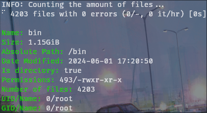

# fsize

This is a project of mine, basically to end my problem with
the damn stat command that is unreadable.

Also because I had free time and a desire to do something different
that does not focus on Microsoft Windows.

The project is focused to be simple and easy to read,
so don't expect very advanced functions, but I will probably
add more according to my needs.

## Screenshots



## Install

You can install it running

```bash
go install -v github.com/Tom5521/fsize@latest
```

Or by copying one of the
[binaries](https://github.com/Tom5521/fsize/releases/latest) to your system to PATH
