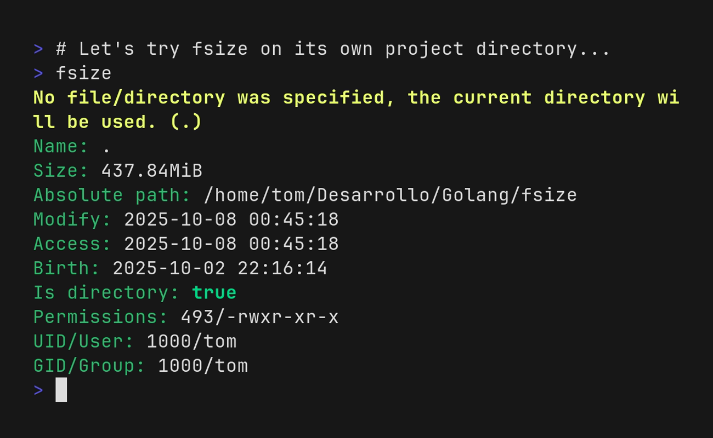

# fsize

This is a project of mine, basically to end my problem with
the damn stat command that is unreadable.

Also, because I had free time and a desire to do something different
that does not focus on Microsoft Windows.

The project is focused to be simple and easy to read,
so don't expect very advanced functions, but I will probably
add more according to my needs.




## Install

You can install it running

```bash
go install -v github.com/Tom5521/fsize@latest
```

However, I recommend this method more:

Basically because go takes a long time to automatically detect the newest tags.
And also this installs the completions

```bash
git clone https://github.com/Tom5521/fsize.git
git checkout $(git describe --tags --abbrev=0) # Go to the latest tag
make local-install # Or it can be "root-install"
```

## Documentation

```
Displays the file/folder properties.

Usage:
  fsize [flags]

Flags:
      --bin-info                  Displays the information of the binary
      --color                     enable or disable the color (default true)
  -c, --config strings            Configure the variables used for preferences
                                  Example: "fsize --config 'always-show-progress=true,always-print-on-walk=false'".

                                  To see the available variables and their values run "fsize --print-settings".
      --gen-bash-completion       Generate a completion file for bash
                                  if any, the first argument will be taken as output file.
      --gen-fish-completion       Generate a completion file for fish
                                  if any, the first argument will be taken as output file.
      --gen-zsh-completion        Generate a completion file for zsh
                                  if any, the first argument will be taken as output file.
  -h, --help                      help for fsize
      --no-progress               Disable any progress indicator.
      --no-walk                   Skips walking inside the directories.
      --no-warns                  Hide possible warnings.
      --print-on-walk             Prints the name of the file being walked if a directory has been selected.
      --print-settings            Prints the current configuration values.
  -p, --progress                  Displays a file count and progress bar when counting and summing file sizes. (default true)
      --progress-delay duration   Specifies how long the program should be counting files
                                  before a progress indicator appears (default 1s)
      --update                    Automatically updates the program by overwriting the binary and regenerating the completions.
  -v, --version                   version for fsize
```

Or by copying one of the
[binaries](https://github.com/Tom5521/fsize/releases/latest) to your system PATH
